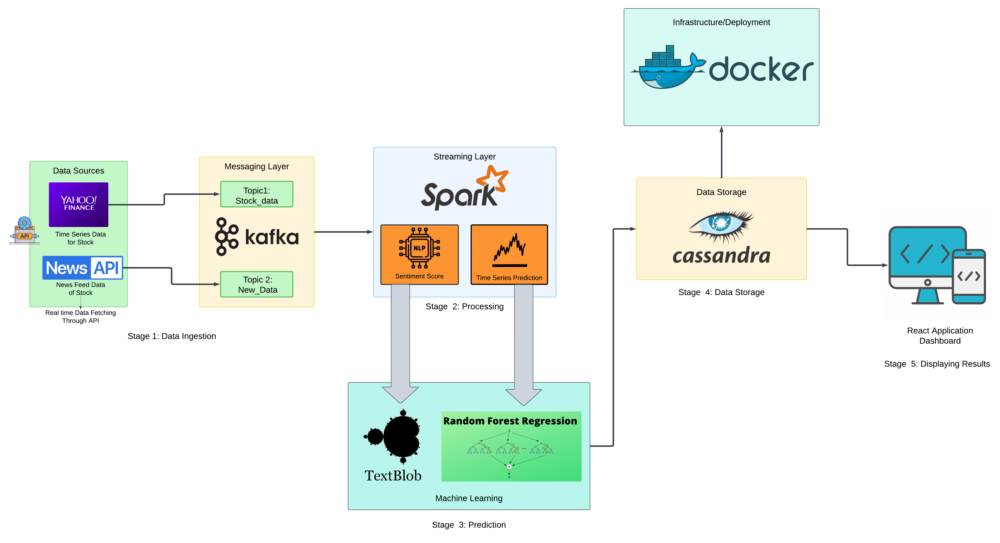

# 📈 Stock Market Trend Prediction Using Big Data Analytics

## 🚀 Overview

This project aims to predict stock market trends using Big Data technologies and machine learning. It integrates real-time financial data and news sentiment to generate accurate and scalable predictions using a Big Data pipeline. The system is designed to be efficient, real-time, and fault-tolerant, suitable for high-frequency financial markets.

---

## 🧠 Problem Statement

Stock markets are volatile and influenced by multiple factors, including historical trends and current news sentiment. Traditional methods fail to keep up with the volume, velocity, and variety of financial data. Hence, we use a Big Data approach to:
- Process vast amounts of stock and news data
- Perform real-time analysis
- Generate accurate stock price predictions

---

## 📊 Architecture

### 🔁 Pipeline Stages:

#### **Stage 1: Data Ingestion**
- **Yahoo Finance API**: Fetches real-time and historical stock prices.
- **News API**: Provides news headlines related to stocks.
- **Kafka**: Acts as a message broker to stream data into the processing layer in real-time.

#### **Stage 2: Data Processing**
- **Apache Spark**: Handles both batch and stream processing.
  - Performs time-series analysis on stock prices.
  - Computes sentiment scores from news articles.

#### **Stage 3: Prediction**
- **TextBlob**: Conducts NLP-based sentiment analysis on financial news.
- **Random Forest Regressor**: Predicts future stock prices using processed data and sentiment scores.
- **Final Formula**:Final Prediction = 0.75 * Raw Prediction + 0.25 * Raw Prediction * Sentiment Score

#### **Stage 4: Data Storage**
- **Apache Cassandra**: Distributed NoSQL database to store predictions and sentiment data efficiently.

#### **Stage 5: Displaying Results**
- **React.js Dashboard**: Frontend to visualize predictions and stock trends for end-users in real-time.

#### **Deployment:**
- **Docker**: Containerizes the complete pipeline for scalable and reproducible deployment.

---

## 🧩 Technology Stack

| Layer | Tool/Technology | Reason for Choosing | Alternatives Considered |
|------|------------------|---------------------|--------------------------|
| Data Ingestion | Yahoo Finance API, News API | Reliable and real-time data | Alpha Vantage, Google Finance |
| Messaging | Kafka | Scalable, real-time stream processing | RabbitMQ, ActiveMQ |
| Processing | Apache Spark | Unified batch & stream processing | Apache Flink, Storm |
| Sentiment Analysis | TextBlob | Lightweight and easy to use | SpaCy, NLTK |
| Machine Learning | Random Forest | Handles non-linear patterns well | ARIMA, LSTM |
| Storage | Apache Cassandra | High availability and fast writes | HBase, MongoDB |
| Frontend | React.js | Fast, component-based UI | Angular, Vue.js |
| Deployment | Docker | Portable and environment-independent | Kubernetes (for large-scale) |

---

## 📈 Results

- **Random Forest Accuracy (only historical data)**: 93.03%
- **Combined with Sentiment Analysis**: 95.67%
- **Final Accuracy** (Visual dashboard): ~96%

---

## 🔮 Future Enhancements

- Integrate **LSTM** or **Transformers** for improved time-series prediction.
- Add **multi-market analysis** for broader applicability.
- Replace TextBlob with **BERT** for contextual sentiment analysis.
- Deploy using **Kubernetes** for large-scale horizontal scaling.

---

## 💡 Conclusion

This project demonstrates the power of combining Big Data with machine learning for solving real-world financial problems. Using Spark, Kafka, and Cassandra ensures the system is scalable, real-time, and fault-tolerant — making it a strong prototype for financial analytics platforms.

---

